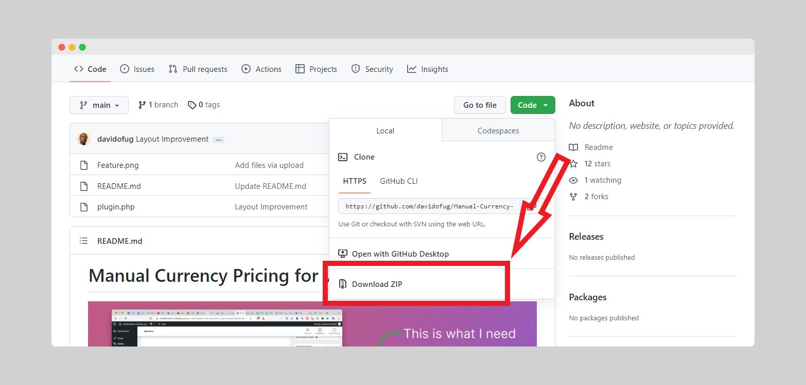
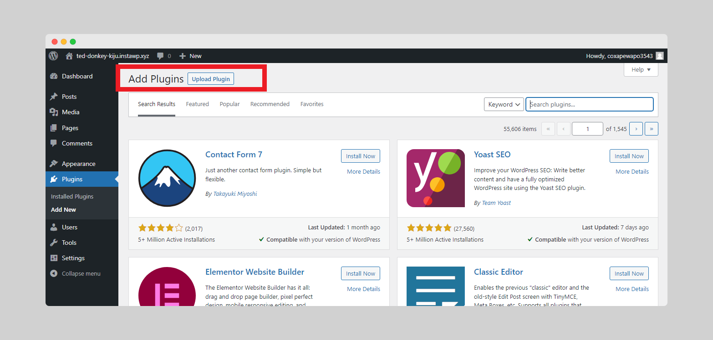
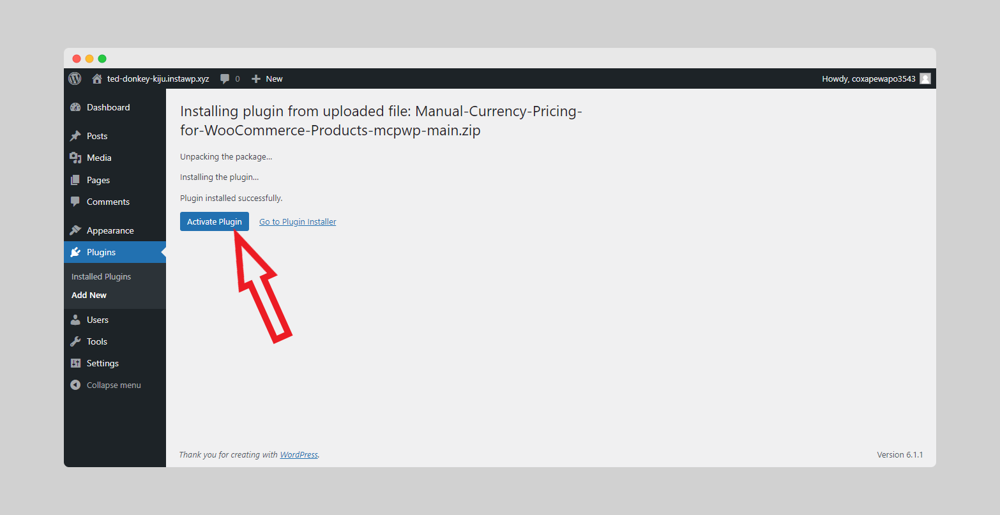
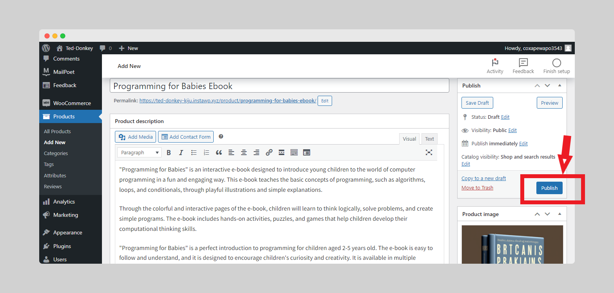

# Manual Currency Pricing for WooCommerce Products

Manual Currency Pricing for WooCommerce Products is a plugin that allows you to add manual currency pricing options to WooCommerce product. With this plugin, you can specify different prices for each currency. This is useful if you want to sell your products in multiple currencies or if you want to override the default currency set in your WooCommerce settings.

## Installation
### Step 1
Go to the [MCPWP GitHub Repository](https://github.com/davidofug/Manual-Currency-Pricing-for-WooCommerce-Products-mcpwp) and download the plugin as zip

### Step 2
Login to your Wordpress Dashboard and navigate to Plugins

### Step 3
Click Add New 

### Step 4
Browse to Upload the downloaded plugin Zip file From your Download directory.

### Step 5
After Uploading the Plugin Click "Install".

### Step 6
Activate the plugin to be able to use it.

You can now find the activated Plugin in Your Wordpress Plugin Directory.

## Alternatively
1. Upload the `manual-currency-pricing-for-woocommerce-products-mcpwp` folder to the `/wp-content/plugins/` directory.
2. Activate the plugin through the 'Plugins' menu in WordPress.
3. Edit a product and you'll see a new option for custom currency pricing.

## Usage

### Manual Currency Pricing

To set different prices for different currencies for a product:

<!-- 1. Edit the product in the WordPress dashboard. -->
1. Add New Product or Edit Product from the Wordpress Dashboard
   
2. Scroll down to the "Manual Currency Pricing" field in the "Product Data" section.
   
3. Click the "Add Row" button to add a new currency and price.
4. Select a currency code from the drop-down list in the "Currency" field.
5. Enter a price for the currency in the "Price" field.
    
6. Repeat steps 3-5 for each currency you want to add.
7. Publish Or Update the product.
   

The prices you set for each currency will be used instead of the default product price when a customer selects that currency on your store.

## Contributors
1. [David Wampamba](https://github.com/davidofug)
2. [Fanny Nyayic](https://github.com/Nyayic)
   
## Support

If you have any questions or issues with the plugin, please [contact me](https://twitter.com/davidofug). I'll do my best to help you out!